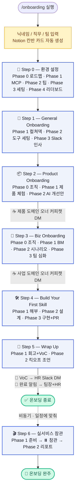

# AI Interactive Onboarding Template

> "AI Native를 말하면서 AI Naive한 온보딩을 하고 있진 않나요?"

Claude Code 기반 **신규입사자 대화형 온보딩 템플릿**입니다. 문서를 "읽는" 온보딩이 아니라, AI 에이전트와 7단계를 **함께 체험**하며 회사·제품·일하는 방식에 스며들게 만드는 구조입니다.

[](./LICENSE)
[](https://www.claude.com/claude-code)
[](https://github.com/Vivi-lee-01/ai-onboarding-template/generate)

📖 **만들게 된 이야기**: [AI Native를 말하면서 AI Naive한 온보딩을 하고 있었다](https://vivi-blog-three.vercel.app/posts/interactive-onboarding)

---

## 왜 이걸 만들었나

"AI Native 조직"이라고 말하면서 신규입사자에겐 PDF와 노션 문서를 한 뭉텅이 던져주고 있었습니다. **말과 경험이 일치하지 않는 모순**. 그래서 온보딩 자체를 "AI와 함께 일하는 법"을 체험하는 과정으로 다시 설계했습니다.

- **읽기 → 체험**: 문서 전달이 아니라 에이전트와 대화하며 진행
- **실시간 fetch 남발 → 로컬 콘텐츠 우선**: 공용 읽기 콘텐츠는 `content/` 로컬 사본을 즉시 읽고, Notion은 편집 원본/쓰기 경로로 사용
- **완료 여부 → 이해도 기반**: 체크박스 대신 단계별 CHECK·리포트·시나리오로 학습 확인
- **혼자 → 연결**: Step 완료 시 담당자·팀장·HR 연결 흐름 자동화

---

## 최신 리뉴얼 반영 범위

이 버전은 실제 운영 온보딩에서 최근 최적화한 구조를 템플릿화한 버전입니다. 회사 고유 정보는 제거하고, 가상의 TeamSpace/Collabo 데이터로 대체했습니다.

반영된 핵심 변경:

- **최신 Step/Phase 구조 유지**: Step 0~6, 각 Step의 `references/*.md` + `references/*-check.md` 분리 구조를 실제 운영 버전과 맞춤
- **STOP PROTOCOL 최신화**: 실행 과제는 `EXPLAIN → EXECUTE → STOP`, 완료 후 `CHECK`로 이어지는 2턴 구조 적용
- **점진적 공개**: 한 번에 과제를 쏟지 않고, 신규입사자가 지금 할 행동 1개를 명확히 알 수 있게 분할
- **콘텐츠 로컬 우선**: 신규입사자 세션 중 공용 콘텐츠를 Notion에서 매번 fetch하지 않고 `content/` 로컬 사본을 읽음
- **Notion은 편집 원본/쓰기 경로**: 콘텐츠 원본 관리, 칸반, 개인 산출물, 개밥먹기 문서 등 상태 변화가 필요한 경로에만 MCP 사용
- **시나리오/퀴즈 plain text 출력**: 선택지만 보이고 문제 본문이 사라지는 TUI 이슈를 막기 위해 시나리오는 본문+선택지를 일반 메시지로 출력
- **TeamSpace 회사정보 보존**: 원본 운영 회사의 고유 정보는 제거하고, TeamSpace Inc. / Collabo / Dana / teamspace.io / teamspace-ai-all 기준으로 로컬화

즉, 진행 방식과 프로토콜은 최신 운영 온보딩을 따르고, 회사/제품/조직 정보만 데모 회사 기준으로 바꾼 형태입니다.

---

## 가상 회사로 바로 체험해보세요

이 템플릿에는 **가상의 B2B SaaS 회사 "TeamSpace Inc."**의 콘텐츠가 채워져 있습니다. 플레이스홀더만 있는 빈 템플릿이 아니라 실제 맥락이 있는 데모 데이터이므로, clone 직후 온보딩 흐름을 체험할 수 있습니다.

| 항목 | 가상 회사 설정 |
|------|--------------|
| **회사명** | TeamSpace Inc. (팀스페이스) |
| **서비스** | Collabo (콜라보) — 실시간 협업 도구 (화이트보드 + 프로젝트 보드) |
| **규모** | 약 40명, 4개 팀 (Product/Growth/Engineering/Operations) |
| **BM** | SaaS 구독 (Free / Pro / Enterprise) |
| **HR Lead** | Dana |

> 자사에 적용할 때는 [`CUSTOMIZATION.md`](CUSTOMIZATION.md)를 참고해 가상 회사 정보를 자사 정보로 교체하세요.

---

## 5분 Getting Started

### 1. 템플릿 사용

상단의 **[Use this template](https://github.com/Vivi-lee-01/ai-onboarding-template/generate)** 버튼 클릭 → 본인 조직에 새 레포 생성.

```bash
git clone https://github.com/YOUR_ORG/your-onboarding.git
cd your-onboarding
```

### 2. 실 설정 파일 생성

```bash
cp config/notion-ids.example.json config/notion-ids.json
cp config/team-leads.example.json config/team-leads.json
```

> `notion-ids.json`과 `team-leads.json`은 `.gitignore`에 등록되어 있어 실수로 커밋되지 않습니다.

### 3. 자사 정보로 커스터마이징

[`CUSTOMIZATION.md`](CUSTOMIZATION.md)의 가이드를 따라 가상 회사 정보를 자사 정보로 교체합니다.

### 4. 콘텐츠 최신화

Notion에 자사 온보딩 콘텐츠를 만든 뒤 Claude Code에서 다음 커맨드를 실행해 공용 읽기 콘텐츠를 `content/`에 동기화합니다.

```text
/sync-content
```

> 신규입사자 세션은 Notion을 매번 fetch하지 않고 `content/` 로컬 사본을 읽습니다. Notion은 편집 원본이고, `/sync-content`는 Notion → 로컬 단방향 갱신입니다.

### 5. 신규입사자에게 전달

```bash
# 신규입사자 로컬에서:
claude
# Claude Code 프롬프트:
/onboarding
```

---

## 온보딩 7단계

| Step | 이름 | 목표 | 산출물 |
|------|------|------|--------|
| **Step 0** | Setup | MCP 연결 + Claude Code 세팅 + 리더보드/설정 최적화 | - |
| **Step 1** | General | 회사 문화, 업무 도구 세팅, Slack 인사 | - |
| **Step 2** | Product | 자사 제품/서비스 체험 (개밥먹기) | Notion 체험 리포트 |
| **Step 3** | Biz | BM, 고객 여정, 시나리오 퀘스트 | - |
| **Step 4** | Build Your First Skill | 스킬 해부 → 설계 → 구현 → PR | GitHub PR |
| **Step 5** | Wrap Up | 회고 + 팀 킥오프 조언 | - |
| **Step 6** | Live Audit | 실서비스/고객 세션 참관 (선택) | 참관 리포트 |

### 시나리오 플로우

> 상세 다이어그램은 [`docs/onboarding-flow.md`](docs/onboarding-flow.md)에서 확인할 수 있습니다.



---

## 핵심 설계

### STOP PROTOCOL

실행 과제가 있는 Phase는 기본 2턴으로 진행됩니다.

```text
턴 1 (Phase A): EXPLAIN → EXECUTE → ⛔ STOP
턴 2 (Phase B): CHECK → 피드백 → 다음 Phase
```

예외와 보완 규칙:

- **읽기 전용 Phase는 1턴**: 신규입사자가 직접 실행할 과제가 없으면 EXPLAIN과 CHECK를 한 턴에 처리합니다.
- **점진적 공개**: EXECUTE 과제가 2개 이상이면 핵심 과제 1개만 제시하고 STOP합니다. 신규입사자가 "했어/다음"이라고 하면 다음 과제 1개를 이어서 제시합니다.
- **상세 접기**: EXPLAIN은 핵심 요약을 먼저 보여주고, 표·비유·트러블슈팅 같은 상세는 요청 시 펼칩니다.
- **시나리오/퀴즈는 plain text**: 상황 설명과 선택지를 일반 메시지로 모두 출력한 뒤 STOP합니다. TUI 선택 위젯으로 문제 본문이 사라지는 상황을 막기 위함입니다.

### 자동화 기능

- **Notion 칸반 자동 업데이트**: Step 시작 시 "진행 중", 완료 시 "완료"로 자동 변경
- **Notion 페이지 자동 생성**: 온보딩 시작 시 대상자 페이지 + 개밥먹기 문서를 템플릿에서 자동 생성
- **Slack 자동 알림**: Step 완료 시 HR + 팀장/셀리드에게 DM 발송, 도메인 오너 커피챗 요청
- **피드백 PR 자동 수집**: 각 Step 종료 시 피드백을 수집하여 GitHub PR로 자동 제출
- **콘텐츠 로컬 우선**: 신규입사자 세션은 `content/`를 읽고, 운영자가 `/sync-content`로 Notion 원본을 로컬 사본에 반영

### 설계 원칙

- **점진적 난이도**: 따라하기(Step 0~1) → 응용(Step 2~3) → 만들기(Step 4~5)
- **팀별 분기**: 소속 팀에 따라 시나리오, 스킬 아이디어, 심화 콘텐츠가 달라짐
- **비동기 지원**: Step 6은 일정에 맞춰 비동기 진행
- **낮은 대기 시간**: `references/{phase}.md`와 `references/{phase}-check.md`를 분리해 필요한 파일만 읽음
- **쓰기 경로만 MCP**: 칸반·개인 Notion 페이지·Slack·PR처럼 상태 변화가 필요한 경로에 MCP를 사용

---

## 프로젝트 구조

```text
.claude/
  agents/
    onboarding-agent.md       # 메인 에이전트 (전체 흐름 제어)
  commands/
    onboarding.md             # 온보딩 시작 커맨드
    sync-content.md           # Notion → content/ 로컬 사본 갱신 커맨드
  skills/
    step0-setup/              # Claude Code 설치 + MCP 연결
    step1-general/            # 문화/도구/Slack 인사
    step2-product/            # 제품 체험
    step3-biz/                # BM, 고객여정, 시나리오 퀘스트
    step4-skill/              # 나만의 스킬 만들기
    step5-wrapup/             # 회고 + 팀 킥오프 조언
    step6-live-audit/         # 실서비스 참관 (선택)
    step*/
      SKILL.md
      references/
        {phase}.md            # Phase A: EXPLAIN + EXECUTE
        {phase}-check.md      # Phase B: CHECK
      evals/evals.json
config/
  notion-ids.example.json     # Notion 페이지 ID 매핑 예시
  team-leads.example.json     # 팀 리더 정보 예시
content/                      # 공용 읽기 콘텐츠 로컬 사본
  README.md
  github-guide.md
  step1-general.md
  step2-product-guide.md
  step3-biz.md
  step6-live-audit.md
scripts/
  sync-from-source.sh         # 원본 레포 → 템플릿 동기화 스크립트
templates/                    # 산출물 템플릿
CLAUDE.md                     # 프로젝트 규칙
CUSTOMIZATION.md              # 자사 정보 커스터마이징 가이드
```

> 이 레포는 **Next.js 앱이 아닙니다** — Claude Code skill 아키텍처 기반이라 서버/빌드 없이 동작합니다.

---

## MCP 연결 (Step 0에서 세팅)

| 서비스 | 용도 |
|--------|------|
| **Notion** | 산출물 저장, 칸반 업데이트, `/sync-content` 콘텐츠 갱신 |
| **Slack** | 완료 알림, 팀 연결, 인사 메시지, 피드백 수집 |
| **Gmail** | 이메일 세팅 확인 |
| **Google Calendar** | 일정 확인 |

---

## 라이선스

[MIT License](./LICENSE) — 자유롭게 fork하여 자사에 맞게 수정하세요.

## Credits

제작: [Vivi Lee](https://github.com/Vivi-lee-01) — 블로그: [vivi-blog-three.vercel.app](https://vivi-blog-three.vercel.app)
